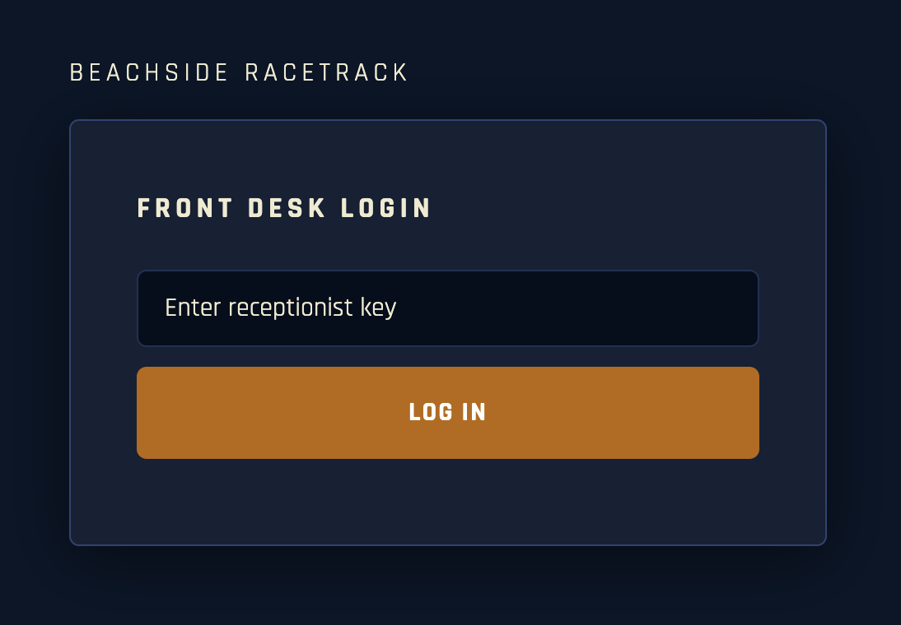
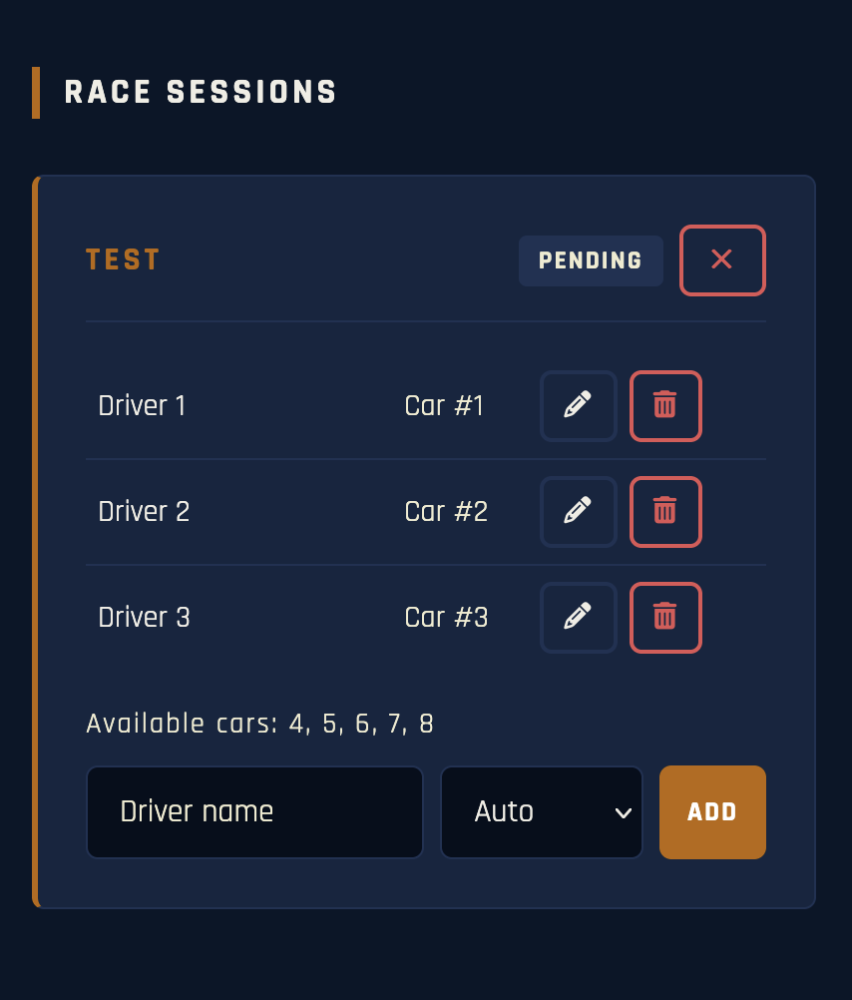
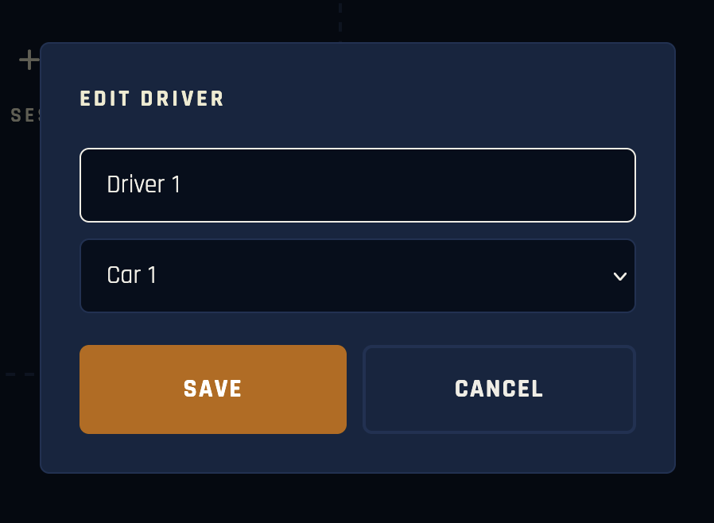
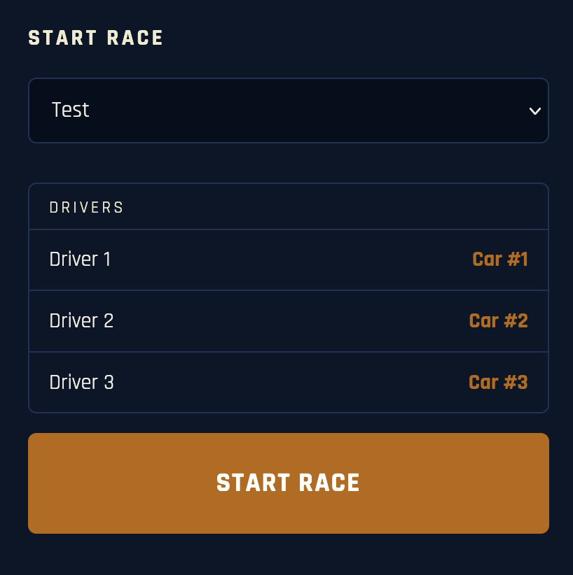
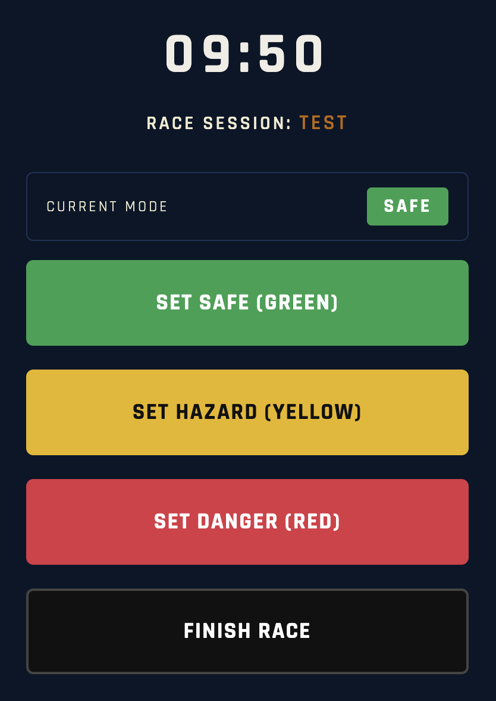
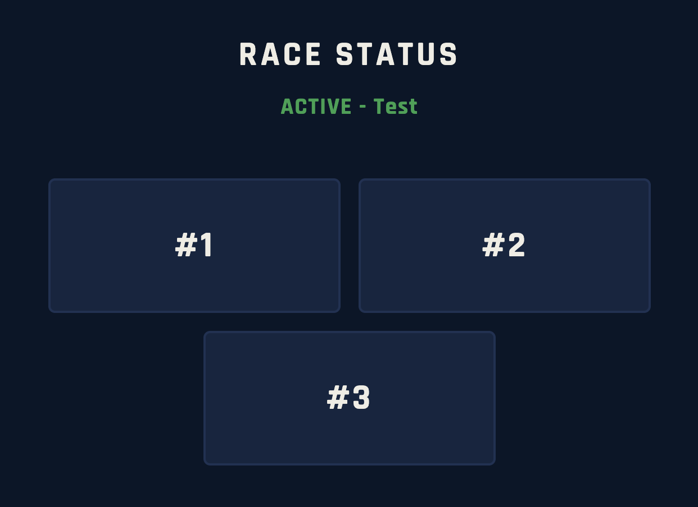
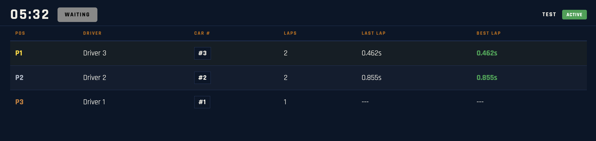
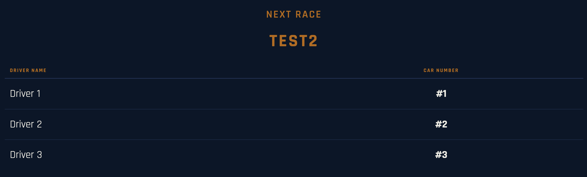

# Beachside Racetrack info-screens

A real-time race management system for Beachside Racetrack. Staff can configure sessions, control races and record lap times. Spectators and race drivers see live updates on public displays.

---

## Setup and Installation

### 1. Install dependencies

```bash
npm install
```

### 2. Set environment variables

Each staff interface is protected by its own access key. The server will not start unless all three keys are defined.

**Option 1:** Copy `.env.example` to `.env` and fill in your own keys:

```
RECEPTIONIST_KEY=your_key_here
OBSERVER_KEY=your_key_here
SAFETY_KEY=your_key_here
PORT=3000
```

**Option 2:** Set them directly in the terminal:

```bash
export RECEPTIONIST_KEY=your_key_here
export OBSERVER_KEY=your_key_here
export SAFETY_KEY=your_key_here
npm start
```

### 3. Start the server

```bash
npm start
```

For development mode (race timer lasts **1 minute** instead of 10):

```bash
npm run dev
```

### 4. Expose to other devices (ngrok)

To make all interfaces accessible from any device on any network, run ngrok:

```bash
ngrok http 3000
```

This gives you a public URL. All routes are then accessible at:

```
https://<ngrok-url>/leader-board
https://<ngrok-url>/next-race
https://<ngrok-url>/race-flags
...
```

---

## Interfaces

### System Hub

The System Hub is available at `/` and links to all interfaces.

### Staff Interfaces (require access key)

| Interface | Persona | Route |
|---|---|---|
| Front Desk | Receptionist | `/front-desk` |
| Race Control | Safety Official | `/race-control` |
| Lap-line Tracker | Lap-line Observer | `/lap-line-tracker` |

### Public Displays

| Interface | Persona | Route |
|---|---|---|
| Leader Board | Spectators | `/leader-board` |
| Next Race | Race Drivers | `/next-race` |
| Race Countdown | Race Drivers | `/race-countdown` |
| Race Flags | Race Drivers | `/race-flags` |

All public displays have a **Full Screen** button in the corner.

---

## User Guide

### System Hub (`/`)

Open the root URL (e.g. `localhost:3000/` or the ngrok URL without any route). It shows a list of links to all interfaces.

---

### Receptionist — Front Desk (`/front-desk`)

1. Log in with the receptionist key.



2. Click **+ New Session** to create a race session.
3. Type a driver name and select a car (or leave on **Auto** to assign automatically).
4. Click **Add** to register the driver.



5. Use the **pencil icon** to edit a driver's name or car number.



6. Use the **trash icon** to remove a driver.
7. Sessions and drivers can only be edited while the session is in **pending** status.

Up to **8 drivers** can be added per session (one per car).

---

### Safety Official — Race Control (`/race-control`)

1. Log in with the safety key.
2. Select a pending session from the dropdown and click **Start Race**.



3. Use the mode buttons to communicate race conditions:
   - **Safe (Green)**: normal racing
   - **Hazard (Yellow)**: drive slowly
   - **Danger (Red)**: stop driving
   - **Finish Race**: chequered flag, return to pit lane



4. Once the race is finished (either by timer or manually), click **End Session & Return** to close the session and queue up the next one.

The race automatically finishes when the 10-minute timer reaches zero.

---

### Lap-line Observer — Lap-line Tracker (`/lap-line-tracker`)

1. Log in with the observer key.
2. When a race starts, large buttons appear, one for each car number.
3. Tap the button for the car number that crosses the lap line.
4. The button flashes green briefly to confirm the lap was recorded.
5. Buttons are disabled after the session is ended by the Safety Official.



---

### Public Displays

#### Leader Board (`/leader-board`)
Shows the live standings for the current race: position, driver name, car number, lap count, last lap time and best lap time. Sorted by fastest lap. Remains on the last race's results until the next race starts.



#### Next Race (`/next-race`)
Shows the upcoming session and which car each driver is assigned to. When a session ends, displays a **Proceed to Paddock** alert for 60 seconds before switching to the next session.



#### Race Countdown (`/race-countdown`)
Shows the remaining race time in large format.

#### Race Flags (`/race-flags`)
Full-screen color display showing the current race mode:

| Mode | Display |
|---|---|
| Safe | Solid Green |
| Hazard | Solid Yellow |
| Danger | Solid Red |
| Finish | Chequered Black/White |


---

## Bonus Features Implemented

- **Data persistence**: session and race state is saved to `config/data.json`. If the server restarts mid-race, the timer resumes from where it left off.
- **Manual car assignment**: the receptionist can choose which car a driver races in, instead of relying only on automatic assignment.
- **Driver editing**: the receptionist can edit a driver's name and car number after registration.

---

## Tech Stack

- **Node.js** + **Express**: server and routing
- **Socket.IO**: all real-time communication (no polling)
- **dotenv**: environment variable management
- Vanilla HTML/CSS/JS
